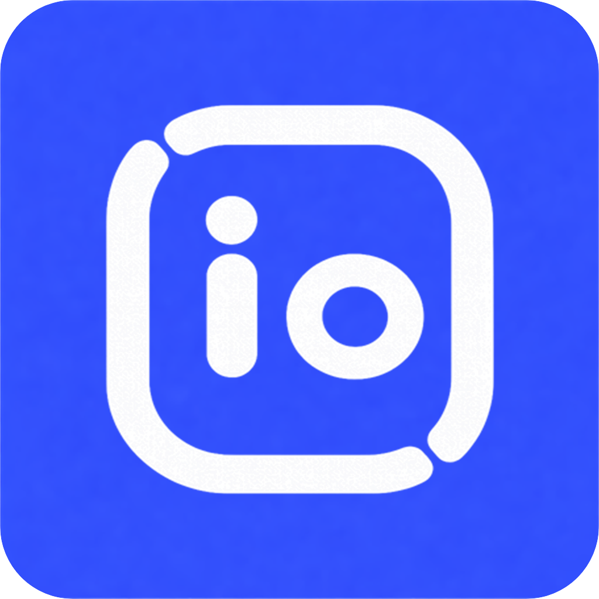
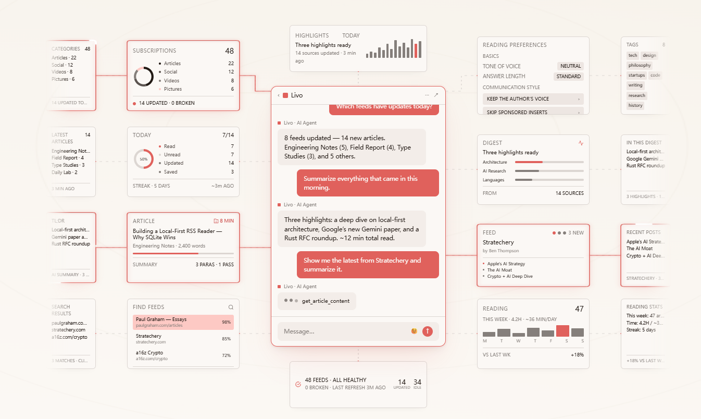
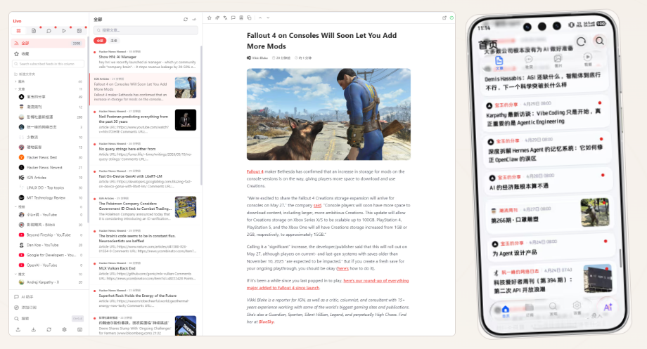

<p align="center">
  
</p>

<h1 align="center">Livo</h1>

<p align="center"><em>Open-source RSS reader - subscriptions, reading, search, favorites, and AI</em></p>

<p align="center">
  <a href="./EN.md">EN.md</a>
  <a href="./README.md">中文.md</a>
</p>

<p align="center">
  
  
  
  
  
  
  
  <a href="./LICENSE">
    
  </a>
</p>

<p align="center">
  
  
</p>

Livo is an open-source RSS reader that brings subscriptions, reading, search, favorites, and AI features into one local-first workflow. Its local-first data model keeps your reading data under your control, while AI features add summaries, translation, and article-aware Q&A to the reading experience.

## Contents

- [Core Features](#core-features)
- [Tech Stack](#tech-stack)
- [Repository Structure](#repository-structure)
- [Quick Start](#quick-start)
- [Common Commands](#common-commands)
- [Data and Storage](#data-and-storage)
- [AI Features](#ai-features)
- [Testing and Verification](#testing-and-verification)
- [Development Docs](#development-docs)
- [License](#license)

## Core Features

- RSS / Atom subscriptions and feed auto-discovery
- Local-first data storage, with core data stored in a local SQLite database
- Full-text reading, history search, favorites, and subscription management
- AI summaries, translation, and article-aware conversational Q&A
- Multiple AI providers, including OpenAI, Anthropic, DeepSeek, Zhipu, Ollama, and custom endpoints
- Electron desktop client and Web entry point

## Tech Stack

- Electron 33 + React 19 + TypeScript 5.9
- Vite 5 + electron-vite
- Zustand + TanStack Query + React Router
- Tailwind CSS 3.4
- SQLite (better-sqlite3)
- OpenAI SDK with multi-provider adapters
- Vitest + ESLint + Prettier

## Repository Structure

```text
Livo/
├── config/                # Build and tooling config (electron-vite / vite-web / electron-builder / eslint / tailwind / vitest / tsconfig.base)
├── src/
│   ├── main/              # Electron main process
│   ├── preload/           # Secure bridge layer
│   ├── renderer/          # React renderer layer
│   ├── shared/            # Shared local types, rules, settings, and utilities
│   └── web/               # Web entry point and adapters
├── scripts/               # Build and debug scripts
├── docs/                  # Design docs, plans, and additional notes
├── package.json           # Single-application scripts and dependencies
└── tsconfig.json          # Main TypeScript config, extending config/tsconfig.base.json
```

## Quick Start

### Prerequisites

- Node.js >= 22
- pnpm >= 10

> **Users in mainland China**: configure a domestic Electron mirror to avoid binary download timeouts during installation.
> Add this to `.npmrc` in the project root:
>
> ```
> electron_mirror=https://npmmirror.com/mirrors/electron/
> ```

### 1. Install dependencies

```bash
pnpm install
```

### 2. Start desktop development

```bash
pnpm dev
```

This starts an Electron window through `electron-vite dev` with HMR enabled.

To use Google OAuth login, create a Google OAuth Desktop Client first, then set the Client ID before starting the app:

```bash
$env:LIVO_GOOGLE_OAUTH_CLIENT_ID="your-desktop-client-id.apps.googleusercontent.com"
pnpm dev
```

### 3. Start Web development mode

```bash
pnpm dev:web
```

The Web entry point reuses the renderer UI, runs in the browser, stores data in IndexedDB, and provides an API shaped like preload through `src/web/web-api.ts`. It is useful for validating the shared reading UI and browser compatibility paths. Features that depend on the Electron main process, such as the local SQLite data directory, system file dialogs, and native downloads, are fully available only in the desktop client.

## Common Commands

```bash
pnpm dev                  # Start desktop development mode
pnpm dev:web              # Start Web development mode
pnpm preview              # Preview the built desktop app
pnpm build                # Build the desktop app
pnpm build:win            # Build the Windows NSIS installer
pnpm build:web            # Build the Web app
pnpm typecheck            # Run type checks
pnpm lint                 # Run lint checks
pnpm format:check         # Check formatting
pnpm test                 # Run tests
```

## Data and Storage

Livo uses a local-first data model. In the desktop client, core data is stored in a SQLite database, with automatic migration from the earlier JSON format. Basic subscription and reading features do not require any online account.

## AI Features

AI features are deeply integrated into the reading flow. Typical uses include:

- Article summaries: generate key points with one click
- Translation: read across languages
- Smart Q&A: chat based on article content

AI providers are configurable. Livo supports OpenAI-compatible APIs and multiple third-party or local model options, so you can choose and switch providers based on your needs.

## Testing and Verification

```bash
pnpm typecheck
pnpm lint
pnpm format:check
pnpm test
```

## Development Docs

- Repository development conventions and collaboration notes: [`AGENTS.md`](AGENTS.md)
- Development entry points, Web limitations, and common verification steps: [`docs/development.md`](docs/development.md)
- Architecture layers, IPC contracts, and data paths: [`docs/architecture.md`](docs/architecture.md)
- Design and implementation docs: `docs/superpowers/specs` and `docs/superpowers/plans`

## Community

This open-source project is linked with and recognizes the [LINUX DO community](https://linux.do).

## Star History

<a href="https://www.star-history.com/?repos=kaieye%2FLivo&type=date&legend=top-left">
 <picture>
   <source media="(prefers-color-scheme: dark)" srcset="https://api.star-history.com/chart?repos=kaieye/Livo&type=date&theme=dark&legend=top-left" />
   <source media="(prefers-color-scheme: light)" srcset="https://api.star-history.com/chart?repos=kaieye/Livo&type=date&legend=top-left" />
   
 </picture>
</a>

## License

AGPL-3.0
