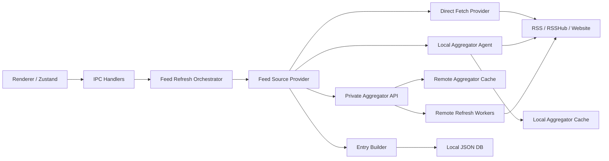

# Livo 私有聚合层设计

## 目标

为 `Livo` 增加一个“小型本地/私有服务端聚合层”，让客户端不再完全依赖桌面端现场抓取 RSS / RSSHub。

这个聚合层的职责是：

1. 提前刷新高风险订阅源，尤其是 Instagram、X、Bilibili 等易超时或易被风控的源。
2. 统一做多实例兜底、重试、退避、去重、缓存和增量同步。
3. 将客户端从“同步抓取器”改为“结果消费者 + 手动触发器”。
4. 保持当前本地 JSON 数据库和 IPC 架构不被推翻，支持渐进迁移。

## 现状

当前 `Livo` 的核心模式是：

1. 渲染进程通过 IPC 调主进程。
2. 主进程在 `feed-refresh.ts` / `rss-parser.ts` 里直接抓取 RSS / RSSHub。
3. 抓到结果后调用 `buildEntriesFromParsedItems`，再写入 `livo-data.json`。

这个模式对普通 RSS 很合适，但对 Instagram 这类源有明显短板：

1. 抓取发生在用户本机网络环境里，稳定性取决于本地网络、Cookie、反爬状态和被选中的 RSSHub 实例。
2. 抓取预算必须偏短，否则会拖慢 UI 行为和手动刷新体验。
3. 一旦抓取失败，就会叠加本地退避，导致“长时间看起来没有新内容”。
4. 多个设备之间无法共享抓取结果。

## 设计原则

1. 保留现有 `Feed` / `Entry` 本地模型，避免大规模重构渲染层。
2. 将“如何获取 feed 原始内容”从“如何把内容落到本地库”里拆开。
3. 允许同一个客户端同时支持三种模式：
   - 直接抓取
   - 本地聚合代理
   - 私有远端聚合服务
4. 默认继续兼容现在的纯本地模式。
5. 先解决“高风险源滞后”，再考虑全量托管。

## 新架构



## 核心改动

### 1. 引入 FeedSourceProvider 抽象

新增一个统一入口，例如：

```ts
export interface AggregatedFeedPayload {
  source: "direct" | "local-agent" | "private-aggregator"
  fetchedAt: number
  etag?: string
  lastModified?: string
  parsed: ParsedFeedLike
  diagnostics?: {
    upstreamsTried?: string[]
    cacheHit?: boolean
    freshnessMs?: number
  }
}

export interface FeedSourceProvider {
  fetch(feed: Feed, options?: { force?: boolean }): Promise<AggregatedFeedPayload>
}
```

然后把当前 `refreshSingleFeed()` 里的这一部分：

1. 规范化 URL
2. 选择 RSSHub 实例
3. 直接请求

改成：

1. 规范化 feed 标识
2. 根据 feed 配置和全局设置选择 provider
3. provider 返回统一 `parsed` 结果
4. 后续继续复用 `buildEntriesFromParsedItems` 和 `insertEntries`

这样可以最大限度复用现有落库逻辑。

### 2. 为 Feed 增加“抓取来源”配置

建议在 `src/shared/types.ts` 中为 `Feed` 和 `AppSettings` 增加以下字段。

#### Feed 级别

```ts
type FeedFetchSource = "auto" | "direct" | "local-agent" | "private-aggregator"

interface Feed {
  ...
  fetchSource?: FeedFetchSource
  remoteFeedId?: string
  upstreamUrl?: string
}
```

#### 全局设置级别

```ts
interface AggregatorSettings {
  mode: "disabled" | "prefer-local-agent" | "prefer-remote" | "remote-only"
  endpoint: string
  apiKey: string
  deviceId: string
  pollIntervalSeconds: number
  pushEnabled: boolean
  cacheRetentionDays: number
}

interface AppSettings {
  ...
  aggregator: AggregatorSettings
}
```

用途：

1. `auto` 表示普通 RSS 继续直连，高风险源走聚合层。
2. `remoteFeedId` 用于和私有服务端 feed 建立稳定映射。
3. `upstreamUrl` 保留原始源地址，避免聚合层返回地址覆盖用户输入。

### 3. 把“刷新”拆成两层

当前 `refreshSingleFeed()` 同时负责：

1. 调上游
2. 解析
3. 合并
4. 更新 feed 状态

建议拆成：

#### `resolveFeedPayload(feed, options)`

职责：

1. 选择 provider
2. 获取统一的 feed payload
3. 返回抓取诊断信息

#### `applyFeedPayload(feed, payload)`

职责：

1. 更新 `lastFetched`、`etag`、`lastModified`
2. 写入标题、头像、描述
3. 构建 entry
4. 插入数据库

这样以后不管数据来自本地抓取、远端 API 还是本地缓存，落库过程都一样。

## 两种聚合形态

## A. 本地聚合代理

这是最适合第一阶段落地的方案。

### 形态

在 Electron 主进程旁边增加一个“本地后台代理”，仍然跑在用户机器上，但从“请求发生在用户点击瞬间”改成“后台持续刷新并缓存”。

### 组成

1. `aggregator-store.json`
   - 存每个 feed 的缓存快照、最近抓取时间、失败次数、上次成功结果摘要。
2. `aggregator-jobs.ts`
   - 调度后台刷新任务。
3. `aggregator-provider.ts`
   - 从缓存返回结果，必要时异步补刷新。
4. `aggregator-fetchers/instagram.ts`
   - 封装高风险源的多实例、多路由、Cookie、重试策略。

### 工作模式

1. 应用启动后，后台代理扫描所有 feed。
2. 对高风险 feed 提前刷新，把解析后的结果缓存到 `aggregator-store.json`。
3. 用户打开列表或点击刷新时，优先读取聚合缓存。
4. 如果缓存过旧，再触发前台等待或后台补拉。

### 优点

1. 不需要部署服务端。
2. 对现有代码改动最小。
3. 立刻能解决“手动刷新时才临时抓取”的滞后问题。

### 缺点

1. 还是受限于用户本地网络。
2. 多设备无法共享结果。
3. 机器不在线就不会刷新。

## B. 私有远端聚合服务

这是第二阶段方案，也是最接近 `Folo-dev` 的模式。

### 形态

单独部署一个轻量服务，例如：

1. Node.js + Fastify / Hono
2. SQLite / PostgreSQL
3. 一个简单 worker 调度器

### 服务端职责

1. 保存订阅源清单。
2. 周期刷新高风险源。
3. 对多个 RSSHub 实例、镜像源和页面解析结果做合并。
4. 按 feed 生成标准化 entry 列表。
5. 提供客户端增量同步接口。

### 推荐 API

#### `POST /v1/feeds/resolve`

输入：

```json
{ "url": "rsshub://instagram/user/katarinabluu?limit=100" }
```

输出：

```json
{
  "feedId": "feed_xxx",
  "canonicalUrl": "rsshub://instagram/user/katarinabluu?limit=100",
  "fetchSource": "private-aggregator"
}
```

#### `POST /v1/feeds/:feedId/refresh`

触发远端立即刷新。

#### `GET /v1/feeds/:feedId/snapshot`

返回 feed 元数据和最近 N 条 entry。

#### `GET /v1/sync?since=...`

返回自某个时间戳之后发生变化的 feed / entry。

#### `POST /v1/entries/ack`

客户端回传阅读状态、收藏状态。

### 服务端存储模型

建议至少有四张表：

1. `feeds`
   - feed 基本信息、原始 URL、规范化 URL、view、状态。
2. `feed_fetch_state`
   - 最近抓取时间、失败次数、退避截止时间、ETag、Last-Modified、最近成功实例。
3. `entries`
   - 规范化后的 entry 数据。
4. `entry_assets`
   - 图片、视频、代理资源、附加 metadata。

### 服务端抓取策略

对于 Instagram / X 这类源，服务端可以做到本地客户端不适合做的事情：

1. 更长超时，例如 20 到 60 秒。
2. 更密集重试。
3. 按 feed 保存“最近成功的实例”，优先命中稳定节点。
4. 后台队列刷新，而不是 UI 线程等待。
5. 多个设备共享同一份已抓取结果。

## 推荐落地顺序

## Phase 1: 本地聚合代理

目标：不部署服务端，先把现场抓取改成“后台缓存 + 前台消费”。

### 新文件建议

1. `src/main/services/feed-source-provider.ts`
2. `src/main/services/aggregator-store.ts`
3. `src/main/services/aggregator-provider.ts`
4. `src/main/services/aggregator-jobs.ts`
5. `src/main/services/aggregator-fetchers/instagram.ts`

### 改造点

1. `feed-refresh.ts`
   - 改为调用 `resolveFeedPayload()`。
2. `index.ts`
   - 应用启动时启动聚合作业调度器。
3. `settings-handlers.ts`
   - 增加聚合层配置存取。
4. `preload/index.ts`
   - 暴露聚合状态查询 IPC。

### 最小功能

1. 仅对 Instagram / X / Bilibili dynamic 开启本地聚合。
2. 每 10 到 20 分钟后台刷新一次。
3. 手动刷新时允许 `force`，直接跳过缓存。
4. 本地缓存返回最近一次成功结果，即使这次刷新失败也不影响展示。

## Phase 2: 私有远端聚合服务

目标：把高风险源从本机网络条件中解耦。

### 客户端改造

在 provider 选择上加策略：

1. 普通 RSS：`direct`
2. Instagram / X：`private-aggregator`
3. 远端失败时：可回退到 `local-agent` 或 `direct`

### 同步策略

建议采用“快照 + 增量混合”：

1. 首次订阅：拉快照。
2. 应用常驻：按 `since` 拉增量。
3. 用户手动刷新：发远端 refresh 请求，然后轮询状态。

## 关键细节

### 1. 统一 Feed Identity

聚合层必须把这些 URL 视为同一个上游 feed：

1. `rsshub://instagram/user/katarinabluu`
2. `https://rsshub.app/instagram/user/katarinabluu`
3. `https://rsshub.pseudoyu.com/picnob/user/katarinabluu`

建议维护一个稳定 key：

```ts
instagram:user:katarinabluu
twitter:user:someone
bilibili:user:123456
```

这个 key 用于：

1. 聚合缓存键
2. 远端 feed 唯一键
3. 最近成功抓取策略

### 2. Entry 不要直接复用“原始 URL”做主键

现有项目已经做了不少 identity merge，这个方向是对的。

聚合层应该直接产出稳定 identity：

1. Instagram 用 shortcode / media pk
2. X 用 tweet id
3. Bilibili 用动态 id / 视频 bvid

客户端继续保留现有 merge 逻辑，但尽量不再依赖上游原始 URL 格式。

### 3. 缓存必须允许“陈旧但可用”

聚合层的一个核心价值，就是把“刷新失败”从“用户看不到内容”里解耦。

因此返回策略应该是：

1. 有新鲜缓存：直接返回。
2. 没有新鲜缓存但有旧缓存：返回旧缓存，同时后台刷新。
3. 完全没有缓存：才做阻塞抓取。

### 4. 诊断信息要落地

建议记录：

1. 最近成功实例
2. 最近失败原因
3. 最近成功抓取时间
4. 最近一次 payload 的 item 数量
5. 最新 item 时间戳

这样后面就能在设置页或诊断页看到“为什么这个 feed 滞后”。

## 对现有代码的映射

### 可以复用的部分

1. `buildEntriesFromParsedItems`
2. `insertEntries`
3. `database.ts` 里的 entry identity merge
4. `rsshub-url.ts` 的 URL 规范化逻辑
5. `post-media-scraper.ts` 的媒体补完能力

### 需要下沉到聚合层的部分

1. `rss-parser.ts` 里的多实例选择
2. Instagram / Twitter 的 fallback 策略
3. 条件请求和退避状态
4. “最新实例优先”决策

## 我建议的最终路线

最优路线不是一步到位做完整远端平台，而是：

1. 先在当前 Electron 应用里做 `local-agent`。
2. 把刷新、缓存、去重、provider 选择这些抽象做对。
3. 等抽象稳定后，再把 `local-agent` 的抓取器搬到独立服务端。

这样有三个好处：

1. 风险低，现有功能不会被整体推翻。
2. 本地版和服务端版共享大部分 provider / merge 逻辑。
3. 后面即使不部署远端，单靠本地后台聚合也能明显提升稳定性。

## 推荐下一步

如果进入实现，我建议按这个顺序做：

1. 新增 `FeedSourceProvider` 抽象。
2. 新增 `aggregator-store.json` 和 `aggregator-provider.ts`。
3. 把 Instagram 先切到 `local-agent`。
4. 增加设置项：聚合模式、远端 endpoint、是否优先聚合层。
5. 最后再决定要不要落地独立远端服务。
